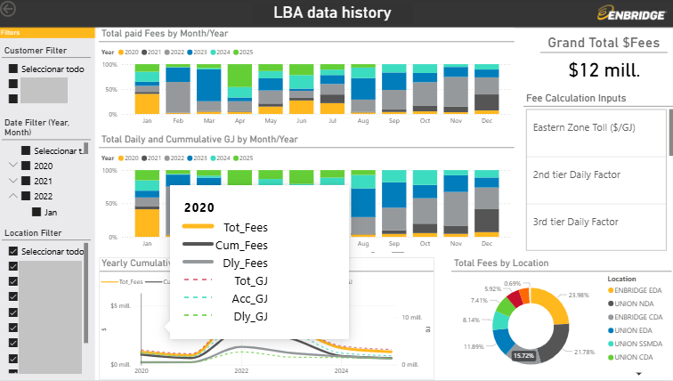

# A pleasure! Let me introduce myself
👋  I’m Max, an Environmental Engineer who oriented his professional journey in the energy sector, specifically natural gas **Transmission** operations to deliver reliable energy.  
If you are not familiar with this concepts, a diagram speaks a thousand words:

## Getting to know me
- 👀 I’m interested in visualizing patterns and bringing out the hidden value among a variety of data.
- 🌱 I’m currently learning
     - 🐍 Data analysis and mining techniques through Python, SQL, and R.
     - 📈 Data visualization and dashboards creation through PowerBI, Google Looker, ArcGIS Dashboards, and IBM Cognos platforms.
     - 🌎 Spatial Data Science through ArcGIS suite. 
- 😄 Pronouns: He / Him
- ⚡ "How about that" fact: Saxophone player.

## What can you find here
- Python projects like energy prices WebScrapping, data cleansing walkthrough, API interaction, SQL integration, Model Evaluation, and Data Visualizations with Plotly and Dash.
- ArcGIS projects like Demographic StoryMaps, [Crime Hot Spot Analysis](https://pro.arcgis.com/en/pro-app/latest/tool-reference/spatial-statistics/optimized-hot-spot-analysis.htm),
  [Heat Risk Index](https://pro.arcgis.com/en/pro-app/latest/help/analysis/raster-functions/heat-index.htm),
  [NDVI Index](https://pro.arcgis.com/en/pro-app/latest/arcpy/spatial-analyst/ndvi.htm),
  [Solar Energy Potential](https://pro.arcgis.com/en/pro-app/latest/tool-reference/spatial-analyst/modeling-solar-radiation.htm),
  and [Suitability Models](https://pro.arcgis.com/en/pro-app/latest/help/analysis/spatial-analyst/suitability-modeler/what-is-the-suitability-modeler.htm).
  - Leveraging Power BI to synthesize energy industry KPIs into intuitive visual narratives that drive data-informed decisions.

## Final thoughts
If you have made it this far, it means that your curiosity about these topics has driven you, and that is great! I hope you will explore the links I have shared. 
If you want to know more, or just want to say Hi, you can reach me here or through

  

    
  
In this fast-paced era, I really want to thank you for your time, and I look forward to getting to know you! 🤝

<!---
MaxCo20/MaxCo20 is a ✨ special ✨ repository because its `README.md` (this file) appears on your GitHub profile.
You can click the Preview link to take a look at your changes.
--->
